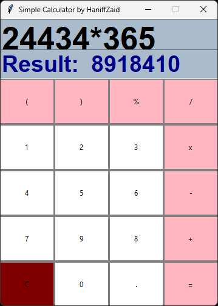

  <h1 align="center">

# 🧮 - Simple Calculator by HaniffZaid

The project aims to develop a straightforward user interface (UI) using Tkinter, which is a popular GUI toolkit for Python. The initial concept is inspired by a tutorial from the YouTube channel Parvat Computer Technology, where basic UI elements and functionalities are demonstrated.

To customize the project further, the author is integrating their own preferences and design choices, moving beyond the original tutorial. This includes experimenting with various widgets, layout management, and event handling to enhance the user experience.

In addition to following the tutorial, the author is actively consulting the Tkinter documentation. This allows for deeper understanding and implementation of advanced features, such as styling options, responsiveness, and interactive components. Overall, the project represents an evolving journey in mastering Tkinter while creating a user-friendly application tailored to the author’s vision.

# Getting started

<ul> 
<li> This Program run on both Windows and Linux operating system by using pycharm, anaconda 3 or all other python editor with the python version 3.x  </li>
<li> This software is developed by python 3.x </li>
<li> Used tkinter module for the Graphical User Interface </li>
<li> It performs  Addition, Subtraction, Multiplication and Division only for two numbers </li>
<li> It is more secure which means you may not enter other anything except the numerical values </li>
<li> It is more relevant and easy to use for an user </li>
</ul>

# Prerequisites
<ul>
<li>You need to install python version 3.x. you may download Python version from their official website: ../ https://www.python.org/downloads/  
</li>
</ul>

For Linux

<ul> 
<li> To install both python and any text editor like pycharm you should do some execution of command line on the terminal.  </li>

</ul>

# Built in
<ul> <li> python 3.x   </li> <li> tkinter python   </li> </ul>

# Contribution
Only Belongs to the <b>Author </b>

# Author
[Haniff Zaid](https://github.com/HaniffZaid)  

# Acknowledgement
Huge thanks to:
- [Parvat Computer Technology](https://www.youtube.com/watch?v=6CZB6VTy3Hg) for showing basic Tkinter usage.
